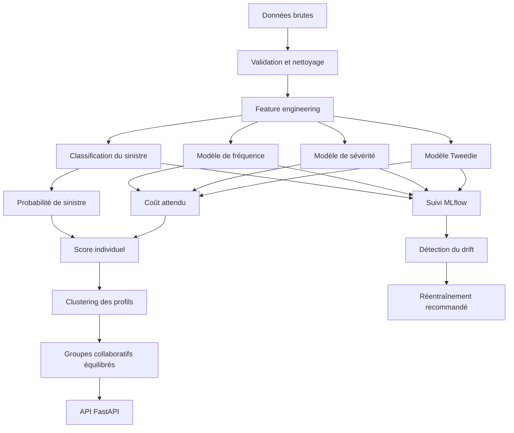

# Système adaptatif de gestion des risques pour l’assurance collaborative

## Présentation

Ce projet développe un système adaptatif de gestion des risques combinant Machine Learning, clustering, MLOps et apprentissage continu pour l’assurance collaborative.

Le système permet de :

- prédire la probabilité de survenue d’un sinistre ;
- estimer la fréquence des sinistres ;
- estimer la sévérité des sinistres ;
- calculer un coût attendu individuel ;
- segmenter les assurés selon leurs caractéristiques ;
- construire des groupes collaboratifs équilibrés ;
- suivre les expériences avec MLflow ;
- détecter le drift des données et des performances ;
- déclencher une recommandation de réentraînement ;
- exposer les prédictions avec une API FastAPI.

---

## Problématique

Dans une assurance collaborative, les assurés sont regroupés afin de mutualiser leurs risques.

La construction de ces groupes ne doit pas être aléatoire. Elle doit prendre en compte :

- la similarité des profils ;
- le niveau de risque individuel ;
- l’équilibre du risque entre les groupes ;
- l’évolution du portefeuille dans le temps ;
- la stabilité des modèles prédictifs.

Le projet répond donc à la problématique suivante :

> Comment construire un système adaptatif capable d’estimer le risque individuel, de former des groupes collaboratifs équilibrés et de mettre à jour ses modèles lorsque les données ou les performances évoluent ?

---

## Objectifs

Les principaux objectifs sont :

1. comprendre et préparer les données d’assurance ;
2. prédire la probabilité de sinistre ;
3. modéliser la fréquence des sinistres ;
4. modéliser leur sévérité ;
5. calculer un coût attendu individuel ;
6. regrouper les assurés présentant des profils similaires ;
7. équilibrer le coût attendu entre les groupes ;
8. automatiser les pipelines de données et de Machine Learning ;
9. suivre les expériences et les modèles avec MLflow ;
10. détecter le drift et préparer l’apprentissage continu ;
11. déployer les modèles à travers une API.

---

## Architecture générale



---

## Structure du projet

```text
assurance-collaborative-mlops/
│
├── data/
│   ├── raw/
│   │   └── data_ex.csv
│   └── processed/
│       ├── cleaned_data.csv
│       ├── risk_scores_year5.csv
│       ├── cluster_assignments_year5.csv
│       ├── collaborative_group_assignments.csv
│       └── collaborative_group_summary.csv
│
├── models/
│   ├── classification_pipeline.joblib
│   ├── classification_metadata.json
│   ├── cost_model_bundle.joblib
│   ├── cost_model_metadata.json
│   ├── grouping_bundle.joblib
│   └── grouping_metadata.json
│
├── notebooks/
│   ├── 01_data_understanding.ipynb
│   ├── 02_data_cleaning.ipynb
│   ├── 03_eda.ipynb
│   ├── 04_feature_engineering.ipynb
│   ├── 05_classification_modeling.ipynb
│   ├── 06_frequency_severity_modeling.ipynb
│   └── 07_clustering.ipynb
│
├── reports/
│   ├── figures/
│   ├── drift_report.csv
│   └── drift_summary.json
│
├── src/
│   ├── __init__.py
│   │
│   ├── api/
│   │   ├── __init__.py
│   │   └── app.py
│   │
│   ├── data/
│   │   ├── __init__.py
│   │   └── prepare_data.py
│   │
│   ├── features/
│   │   ├── __init__.py
│   │   └── build_features.py
│   │
│   ├── models/
│   │   ├── __init__.py
│   │   ├── train_classification.py
│   │   ├── train_cost.py
│   │   ├── build_groups.py
│   │   └── run_mlflow_pipeline.py
│   │
│   └── monitoring/
│       ├── __init__.py
│       └── drift_detection.py
│
├── tests/
│   ├── __init__.py
│   └── test_api.py
│
├── .gitignore
├── mlflow.db
├── requirements.txt
└── README.md
```

---

## Dataset

Le dataset utilisé provient des données de réplication associées au travail :

> Tail-Sensitive Insurance Pricing: An Economic Extension of the Esscher Principle.

Le dataset possède une structure longitudinale.

Une ligne correspond à un contrat d’assurance identifié par `PolID` pendant une année donnée.

### Dimensions initiales

- 122 935 observations ;
- 22 colonnes ;
- 40 284 contrats différents ;
- 5 années d’observation.

### Structure temporelle

La combinaison suivante est unique :

```text
PolID + year
```

Un contrat peut donc apparaître plusieurs fois, mais une seule fois pendant une année donnée.

---

## Compréhension et qualité des données

Les contrôles initiaux ont montré :

- aucune valeur manquante dans le fichier brut ;
- aucune ligne complètement dupliquée ;
- aucune duplication de la combinaison `PolID-year` ;
- aucune valeur négative dans les nombres ou les montants des sinistres ;
- des distributions fortement asymétriques ;
- une forte proportion d’observations sans sinistre ;
- quelques sinistres avec des montants très élevés.

La colonne suivante est supprimée :

```text
Unnamed: 0
```

Elle correspond à un ancien index sauvegardé dans le fichier CSV.

Les sinistres extrêmes ne sont pas supprimés automatiquement, car ils contiennent une information essentielle pour l’étude du risque de queue.

---

## Variables cibles

### Présence d’un sinistre

```text
Has_Claim
```

La variable vaut :

- `0` : aucun sinistre déclaré ;
- `1` : au moins un sinistre déclaré.

Elle est calculée avec :

```text
Has_Claim = 1 si Total_NClaims > 0
```

### Nombre total de sinistres

```text
Total_NClaims = NClaims1 + NClaims2
```

Cette variable est utilisée pour la modélisation de la fréquence.

### Coût total

```text
Total_Claims = Claims1 + Claims2
```

Cette variable représente le coût total des sinistres.

### Présence d’un paiement

```text
Has_Paid_Claim
```

Elle vaut `1` lorsque `Total_Claims` est strictement positif.

### Sévérité moyenne

```text
Average_Claim_Severity
```

Elle est définie par :

```text
Average_Claim_Severity = Total_Claims / Total_NClaims
```

La sévérité est définie uniquement lorsqu’au moins un sinistre est déclaré.

---

## Variables explicatives

Les modèles utilisent treize variables explicatives.

### Variables numériques

- `Age_client`
- `age_of_car_M`
- `Car_power_M`
- `Insuredcapital_content_re`
- `Insuredcapital_continent_re`
- `Client_Seniority`

### Variables binaires

- `gender`
- `Car_2ndDriver_M`
- `num_policiesC`
- `metro_code`
- `Policy_PaymentMethodA`
- `Policy_PaymentMethodH`
- `appartment`

---

## Prévention des fuites de données

Les variables suivantes ne sont pas utilisées comme prédicteurs :

- `PolID`, car il s’agit d’un identifiant ;
- `year`, car elle est principalement utilisée pour le découpage temporel ;
- `Types`, car elle est directement associée à la nature des sinistres ;
- `NClaims1` et `NClaims2` ;
- `Claims1` et `Claims2` ;
- les cibles dérivées ;
- `Retention`, tant que sa disponibilité avant la période de prédiction n’est pas confirmée.

Cette séparation empêche les modèles d’utiliser une information observée après le sinistre.

---

## Découpage temporel

Le projet utilise une validation temporelle :

| Ensemble | Années | Utilisation |
|---|---|---|
| Entraînement | 1, 2 et 3 | Apprentissage des modèles |
| Validation | 4 | Sélection des modèles et des seuils |
| Test final | 5 | Évaluation finale indépendante |

Après la sélection, le modèle final est réentraîné sur les années 1 à 4 puis évalué une seule fois sur l’année 5.

Cette organisation simule une utilisation réelle :

```text
Passé → entraînement
Présent → validation
Futur → test
```

---

## Prétraitement

Les variables numériques sont standardisées avec `StandardScaler`.

La standardisation applique :

\[
z = \frac{x-\mu}{\sigma}
\]

Les moyennes et écarts-types sont calculés uniquement sur les données d’entraînement.

Les variables binaires restent codées avec `0` et `1`.

Le prétraitement est intégré directement dans les pipelines Scikit-learn afin de garantir :

- la reproductibilité ;
- l’absence de fuite ;
- la cohérence entre entraînement et prédiction ;
- la sauvegarde du prétraitement avec le modèle ;
- le déploiement dans l’API.

---

## Classification du risque

L’objectif est de prédire :

```text
Has_Claim
```

Deux modèles sont comparés :

- régression logistique ;
- Random Forest.

### Gestion du déséquilibre

La classe avec sinistre est minoritaire.

Les modèles utilisent donc une pondération équilibrée des classes.

### Métriques

Les principales métriques sont :

- précision ;
- rappel ;
- F1-score ;
- ROC-AUC ;
- PR-AUC.

L’accuracy n’est pas utilisée seule, car un modèle prédisant toujours l’absence de sinistre pourrait obtenir une accuracy artificiellement élevée.

### Sélection du modèle

Le modèle est sélectionné selon la PR-AUC obtenue sur l’année 4.

### Sélection du seuil

Le seuil de classification est choisi sur la validation en maximisant le F1-score.

Le seuil final n’est pas ajusté sur l’année de test.

---

## Modélisation de la fréquence

La cible est :

```text
Total_NClaims
```

Le modèle utilisé est une régression de Poisson.

Elle est adaptée aux variables :

- entières ;
- non négatives ;
- représentant un nombre d’événements.

Les métriques utilisées incluent :

- MAE ;
- RMSE ;
- déviance de Poisson ;
- comparaison entre fréquence réelle et fréquence prédite.

---

## Modélisation de la sévérité

La cible est :

```text
Average_Claim_Severity
```

Le modèle utilisé est une régression Gamma.

La régression Gamma est entraînée uniquement sur les observations présentant un montant strictement positif.

Elle est adaptée à une cible :

- continue ;
- positive ;
- fortement asymétrique ;
- présentant des coûts élevés peu fréquents.

---

## Modélisation du coût attendu

Deux approches sont comparées.

### Approche fréquence–sévérité

\[
\widehat{Coût}
=
\widehat{Fréquence}
\times
\widehat{Sévérité}
\]

### Approche Tweedie

Une régression Tweedie modélise directement :

```text
Total_Claims
```

La loi Tweedie avec une puissance comprise entre 1 et 2 est adaptée à une cible contenant :

- beaucoup de valeurs nulles ;
- des montants continus positifs ;
- une forte asymétrie.

### Sélection

L’approche finale est sélectionnée selon la déviance Tweedie obtenue sur l’année de validation.

---

## Score individuel de risque

Le système produit pour chaque contrat :

- une probabilité de sinistre ;
- une classe prédite ;
- une fréquence prédite ;
- une sévérité prédite ;
- un coût attendu ;
- un décile de risque ;
- un niveau de risque.

Les niveaux sont définis relativement au portefeuille :

| Déciles | Niveau |
|---|---|
| 1 à 4 | Faible |
| 5 à 7 | Moyen |
| 8 à 10 | Élevé |

Ces catégories ne constituent pas des seuils réglementaires.

---

## Clustering des assurés

Le clustering utilise K-Means.

Les assurés sont segmentés selon leurs caractéristiques, sans utiliser :

- les sinistres réels ;
- les coûts réels ;
- les cibles ;
- les scores de risque.

### Sélection du nombre de clusters

Les valeurs de `K` comprises entre 2 et 10 sont comparées avec :

- l’inertie ;
- le score de silhouette ;
- la taille des clusters ;
- leur interprétabilité.

### Limite

K-Means est principalement conçu pour des variables numériques continues.

Son utilisation sur des données mixtes constitue une baseline. Les variables binaires sont standardisées afin de contrôler les différences d’échelle.

---

## Construction des groupes collaboratifs

Les clusters représentent des segments de profils similaires.

Les groupes collaboratifs finaux sont ensuite construits à l’intérieur de chaque cluster.

### Taille cible

```text
50 assurés par groupe
```

### Algorithme

Pour chaque cluster :

1. les assurés sont triés selon leur coût attendu ;
2. le nombre de groupes est calculé ;
3. les capacités sont réparties équitablement ;
4. chaque assuré est affecté au groupe ayant le coût attendu cumulé le plus faible ;
5. la capacité maximale de chaque groupe est respectée.

Cette méthode cherche à garantir :

- la similarité des profils ;
- l’équilibre du risque ;
- des groupes de taille comparable ;
- l’absence de concentration excessive des profils à coût élevé.

Les sinistres réels ne sont jamais utilisés pendant la formation des groupes.

---

## Évaluation des groupes

La méthode équilibrée est comparée à une affectation aléatoire conservant :

- les mêmes clusters ;
- le même nombre de groupes ;
- les mêmes tailles.

Les métriques utilisées comprennent :

- coefficient de variation du coût attendu ;
- étendue relative du coût attendu ;
- dispersion des pertes réelles ;
- concentration des pertes dans les groupes les plus coûteux.

Le coût réel sert uniquement à l’évaluation rétrospective.

---

## MLOps avec MLflow

MLflow permet de suivre :

- les paramètres ;
- les modèles candidats ;
- les métriques de validation ;
- les métriques de test ;
- les seuils ;
- les artefacts ;
- les scores ;
- les groupes collaboratifs.

Le backend local utilise SQLite :

```text
mlflow.db
```

L’expérience principale est :

```text
adaptive-collaborative-insurance
```

Le pipeline MLflow contient :

- préparation des données ;
- entraînement de la classification ;
- entraînement des modèles de coût ;
- création des groupes collaboratifs.

---

## Détection du drift

Le système compare :

- les années 1 à 4 comme référence ;
- l’année 5 comme période actuelle.

### Data drift

Le Population Stability Index est calculé pour chaque variable.

Les seuils utilisés sont :

| PSI | Interprétation |
|---:|---|
| inférieur à 0,10 | Stable |
| entre 0,10 et 0,25 | Drift modéré |
| supérieur ou égal à 0,25 | Drift significatif |

### Performance drift

Le système surveille notamment :

- la PR-AUC ;
- la ROC-AUC ;
- le taux de sinistre ;
- la probabilité moyenne prédite.

### Déclenchement du réentraînement

Un réentraînement est recommandé lorsqu’au moins une condition est satisfaite :

- présence d’une variable avec drift significatif ;
- baisse de PR-AUC supérieure au seuil défini ;
- variation relative importante du taux de sinistre.

---

## API FastAPI

L’API expose les modèles à travers plusieurs endpoints.

### Racine

```text
GET /
```

### État du système

```text
GET /health
```

### Prédiction

```text
POST /predict
```

La réponse contient :

```json
{
  "claim_probability": 0.42,
  "predicted_claim_class": 0,
  "classification_threshold": 0.51,
  "predicted_frequency": 0.06,
  "predicted_severity": 850.2,
  "predicted_expected_cost": 51.01,
  "cost_model_approach": "tweedie",
  "profile_cluster": 2
}
```

Les valeurs sont données uniquement comme exemple.

---

## Installation

### Prérequis

- Python 3.11 ou version compatible ;
- Git ;
- VS Code recommandé.

### Cloner le projet

```bash
git clone <URL_DU_DEPOT>
cd assurance-collaborative-mlops
```

### Créer l’environnement virtuel sous Windows

```powershell
python -m venv .venv
```

### Installer les dépendances

```powershell
.\.venv\Scripts\python.exe -m pip install -r requirements.txt
```

### Ajouter les données

Place le fichier brut dans :

```text
data/raw/data_ex.csv
```

---

## Exécution du projet

Toutes les commandes doivent être exécutées depuis la racine.

### Préparer les données

```powershell
.\.venv\Scripts\python.exe -m src.data.prepare_data
```

### Vérifier les variables et le découpage

```powershell
.\.venv\Scripts\python.exe -m src.features.build_features
```

### Entraîner la classification

```powershell
.\.venv\Scripts\python.exe -m src.models.train_classification
```

### Entraîner les modèles de coût

```powershell
.\.venv\Scripts\python.exe -m src.models.train_cost
```

### Construire les groupes

```powershell
.\.venv\Scripts\python.exe -m src.models.build_groups
```

### Exécuter le pipeline MLflow complet

```powershell
.\.venv\Scripts\python.exe -m src.models.run_mlflow_pipeline
```

---

## Interface MLflow

Lancer l’interface :

```powershell
.\.venv\Scripts\python.exe -m mlflow ui --backend-store-uri sqlite:///mlflow.db
```

Puis ouvrir :

```text
http://127.0.0.1:5000
```

---

## Surveillance du drift

Exécuter :

```powershell
.\.venv\Scripts\python.exe -m src.monitoring.drift_detection
```

Les résultats sont enregistrés dans :

```text
reports/drift_report.csv
reports/drift_summary.json
```

---

## Lancer l’API

```powershell
.\.venv\Scripts\python.exe -m uvicorn src.api.app:app --reload
```

Documentation Swagger :

```text
http://127.0.0.1:8000/docs
```

État de l’API :

```text
http://127.0.0.1:8000/health
```

---

## Tests

Installer les dépendances de test si nécessaire :

```powershell
.\.venv\Scripts\python.exe -m pip install pytest httpx
```

Exécuter :

```powershell
.\.venv\Scripts\python.exe -m pytest -v
```

Les tests vérifient :

- la disponibilité de la racine ;
- le chargement des modèles ;
- l’état de l’API ;
- la validité des prédictions ;
- le rejet des valeurs binaires invalides ;
- le rejet des âges impossibles ;
- le rejet des variables absentes.

---

## Pipeline d’apprentissage continu

Le cycle d’apprentissage continu prévu est :

1. recevoir une nouvelle période de données ;
2. valider la structure et la qualité ;
3. calculer le drift des variables ;
4. évaluer les performances du modèle actuel ;
5. vérifier les règles de réentraînement ;
6. entraîner de nouveaux modèles si nécessaire ;
7. comparer le challenger au modèle actuel ;
8. valider le nouveau modèle ;
9. enregistrer sa version dans MLflow ;
10. redéployer l’API ;
11. recalculer les scores ;
12. reconstruire les groupes collaboratifs.

---

## Résultats produits

Le projet génère notamment :

```text
data/processed/cleaned_data.csv
data/processed/risk_scores_year5.csv
data/processed/cluster_assignments_year5.csv
data/processed/collaborative_group_assignments.csv
data/processed/collaborative_group_summary.csv
models/classification_pipeline.joblib
models/classification_metadata.json
models/cost_model_bundle.joblib
models/cost_model_metadata.json
models/grouping_bundle.joblib
models/grouping_metadata.json
reports/drift_report.csv
reports/drift_summary.json
```

---

## Limites

Les principales limites sont :

- absence de dictionnaire métier complet pour certaines variables ;
- utilisation de K-Means comme approximation pour des données mixtes ;
- faible fréquence des sinistres ;
- difficulté à prévoir les sinistres extrêmes ;
- validation disponible sur seulement cinq périodes ;
- absence actuelle de données futures réelles en production ;
- seuils de drift définis comme baseline ;
- nécessité de valider les règles avec des experts en assurance ;
- nécessité d’étudier l’équité et les contraintes réglementaires ;
- résultats non destinés à une utilisation réelle sans validation supplémentaire.

---

## Améliorations futures

Les évolutions possibles comprennent :

- K-Prototypes ou distance de Gower pour les données mixtes ;
- modèles de Gradient Boosting ;
- calibration des probabilités ;
- optimisation avancée des hyperparamètres ;
- modèles sensibles aux queues de distribution ;
- déploiement Docker ;
- intégration continue avec GitHub Actions ;
- registre de modèles MLflow ;
- stockage PostgreSQL ;
- monitoring en temps réel ;
- dashboard de suivi des groupes ;
- règles avancées d’équité et de diversification ;
- réentraînement automatique contrôlé.

---

## Technologies

- Python
- Pandas
- NumPy
- Matplotlib
- Seaborn
- Scikit-learn
- MLflow
- FastAPI
- Uvicorn
- Pydantic
- Pytest
- Jupyter
- SQLite

---

## Auteur

Iman ELAMRANI

> Système adaptatif de gestion des risques : MLOps et apprentissage continu pour l’assurance collaborative.
